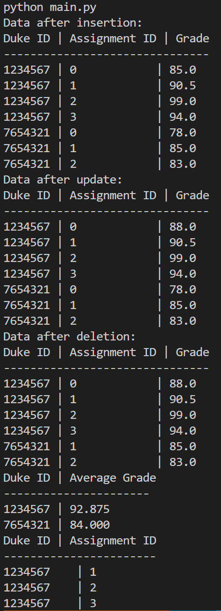
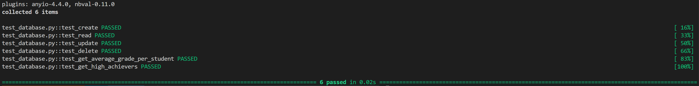

# IDS706_Python_Script_interacting_with_SQL_Database_hx84


## Requirements
* Requirements
    - Connect to a SQL database
    - Perform CRUD operations
    - Write at least two different SQL queries
* Grading Criteria
    - Database connection (20 points)
    - CRUD operations (20 points)
    - CI/CD pipeline (10 points)
    - README.md (10 points)
* Deliverables
    - Python script

## Introduction

This project creates a SQLite database called [`ids706_grades.db`](./ids706_grades.db) to store and manage student grades for the IDS706 course. The database contains three columns:
- **duke_id**: The unique ID of the student.
- **assignment_id**: The unique ID for each assignment.
- **grade**: The grade received by the student for the assignment.

The main functionality includes creating the table, performing CRUD operations (Create, Read, Update, Delete), and running SQL queries to analyze the data, such as retrieving the average grade for each student or filtering by certain grade thresholds.

## Functions

### 1. **`connect_to_db(db_name)`**

   - **Returns**: A connection object that allows interaction with the database.

### 2. **`create_table(conn)`**

   - **Description**: 
     - This function creates a table with a composite primary key of `duke_id` and `assignment_id`. If the table already exists, it will not create a new one.

### 3. **`insert_data(conn, duke_id, assignment_id, grade)`**

   - **Description**: 
     - This function adds a new entry (student ID, assignment ID, and grade) to the `grades` table. Each combination of `duke_id` and `assignment_id` must be unique due to the composite primary key.

### 4. **`read_data(conn)`**

   - **Description**: 
     - This function reads all the rows from the `grades` table and returns them as a list.
   - **Returns**: A list of tuples where each tuple represents a row in the table (`duke_id`, `assignment_id`, `grade`).


### 5. **`update_data(conn, duke_id, assignment_id, new_grade)`**

   - **Description**: 
     - This function updates the grade for the given `duke_id` and `assignment_id` combination.

### 6. **`delete_data(conn, duke_id, assignment_id)`**

   - **Description**: 
     - This function deletes a grade from the `grades` table based on the provided `duke_id` and `assignment_id`.

### 7. **`get_average_grade_per_student(conn)`**

   - **Description**: 
     - This function uses SQL's `AVG()` and `GROUP BY` clauses to calculate and return the average grade for each `duke_id`.
   - **Returns**: A list of tuples where each tuple contains the `duke_id` and the average grade for that student.


### 8. **`get_high_achievers(conn)`**

   - **Description**: 
     - This function filters out the students and assignments that have grades higher than 90.
   - **Returns**: A list of tuples containing the `duke_id` and `assignment_id` where the grade is greater than 90.


## Queries
Here are the two queries used in `get_average_grade_per_student(conn)` and `get_high_achievers(conn)` repectively.
1. **Get the average grade for each student**:
   ```sql
   SELECT duke_id, AVG(grade) AS average_grade FROM grades GROUP BY duke_id;
   ```

2. **Get the `duke_id` and `assignment_id` for grades greater than 90**:
   ```sql
   SELECT duke_id, assignment_id FROM grades WHERE grade > 90;
   ```

## Runtime screenshot and test log

* Screenshot of operations results

    

* Test log

    